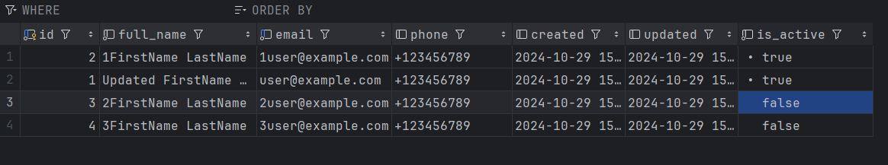
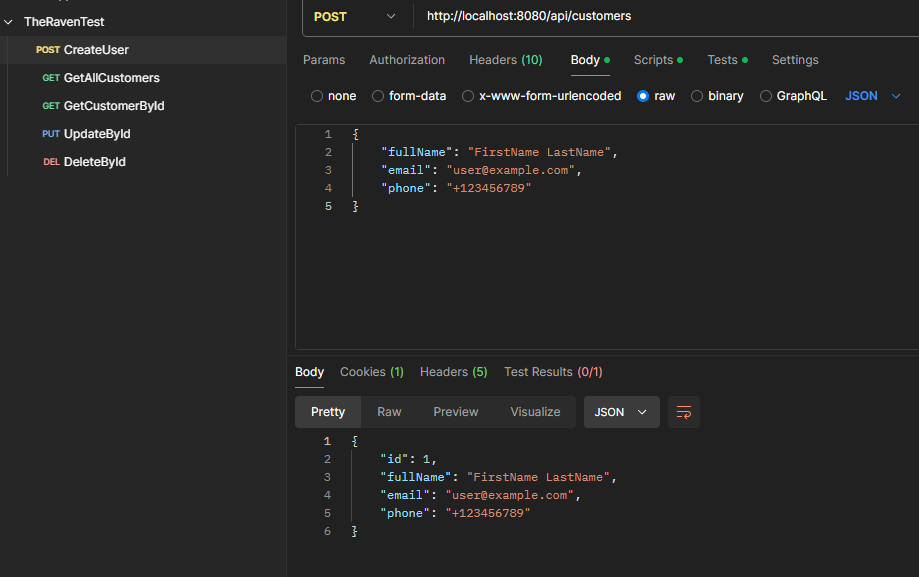

# Customer Management API

## Project Overview

Welcome to the **Customer Management API**! This project is a RESTful API designed to manage customer information efficiently. Built using **Spring Boot** and **PostgreSQL**, it provides functionalities for creating, reading, updating, and deleting customer records while ensuring data integrity through validation and comprehensive error handling.

## Technologies Used

This project employs the following technologies:

- **Spring Boot**: The backbone framework for building the RESTful web service.
- **Spring Data JPA**: Facilitates data access and Object-Relational Mapping (ORM) with PostgreSQL.
- **PostgreSQL**: A powerful relational database management system for storing customer data.
- **Lombok**: A library that reduces boilerplate code in data classes.
- **Java Bean Validation**: Ensures the integrity of input data.
- **Postman**: A tool for testing the API endpoints.

## Architecture

The architecture follows a layered approach, enhancing separation of concerns:

1. **Controller Layer**: Manages HTTP requests and responses. The `CustomerController` handles all customer-related operations.
2. **Service Layer**: Contains business logic and coordinates between the controller and repository layers. The `CustomerService` manages core functionality.
3. **Repository Layer**: Interacts with the database. The `CustomerRepository` leverages Spring Data JPA for CRUD operations.
4. **Entity Layer**: Defines the data model. The `Customer` entity represents the customer table in the database.
5. **DTO Layer**: Contains Data Transfer Objects (DTOs) like `CustomerDTO` for seamless data transfer between client and server.

## How to Run the Project

Follow these steps to get the project up and running:

1. **Clone the Repository**:

   ```bash
   git clone https://github.com/YaremchukVadym/TheRavenTest.git
   ```

2. **Set Up PostgreSQL Database**:

    - Create a new database named `raven`.
    - Update the `application.properties` file with the correct database URL, username, and password.

3. **Build the Project**:

   Ensure you have [Maven](https://maven.apache.org/) installed, then run:

   ```bash
   mvn clean install
   ```

4. **Run the Application**:

   You can start the application using:

   ```bash
   mvn spring-boot:run
   ```

   The application will be accessible at `http://localhost:8080`.

## Testing with Postman

You can test the API using Postman. Below are some example requests:

- **Create a Customer**:
    - **Method**: POST
    - **URL**: `http://localhost:8080/api/customers`
    

- **Get All Customers**:
    - **Method**: GET
    - **URL**: `http://localhost:8080/api/customers`

- **Get a Customer by ID**:
    - **Method**: GET
    - **URL**: `http://localhost:8080/api/customers/{id}`

- **Update a Customer**:
    - **Method**: PUT
    - **URL**: `http://localhost:8080/api/customers/{id}`

- **Delete a Customer**:
    - **Method**: DELETE
    - **URL**: `http://localhost:8080/api/customers/{id}`

## Database Schema

Here is a visual representation of the database schema:



## Postman

Here is a visual representation of the Postman test:


